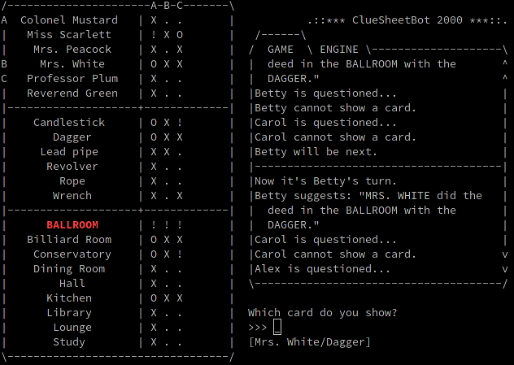

# ClueSheetBot
:game_die: *Your analytical relational friendly neighbourhood Clue Bot* :game_die:

Assistant for the board game *Clue[do]* featuring a **virtual sheet** and a **powerful deduction engine**.
The text-based user interface aims for maximum efficiency while providing a full overview of the game state in one single screen.



## Features
- **Virtual sheet** automatically records facts and clues
  - Configurable card names for different game editions
  - Intelligent color highlighting
- **Powerful Deduction engine**
  - Fact based deductions
    - `The Romeo and Juliet`, `Highlander` and `What's-in-the-box?!?!?` techniques provide surefire deductions based on the fact that all cards are unique, finite and the number of cards in each players' hands is known.
  - Clue based deductions: The knowledge that other players have shown each other one of three possible cards after a suggestion is used.
  - Chain reaction deductions
  - Fuzzy-tri-state logic(:tm:): A player may either hold a card or not - or even something in between!
  - Perspective views: Internal calculations based on separate game records from each player's perspective
- Records everything
  - Full scrollable game log
  - **Retroactive deduction**
  - **Replay files** (can act as savegames as well)
- Database powered
  - Manually alter clues: A player accidentally dropped a card? This information can be used to your advantage.
  - **Undo a turn** if mistakes were made
  - Could be used as read-only interface (SQLite) to power external apps
- Clever user interface
  - Text-based single screen display of clue sheet, log and input
  - **Full guidance** through game flow
  - Context-sensitive multi-state **input prompt with auto-completion**
  - Built-in help and sanity checks

## Requirements
- Python 3 on any OS

## Usage
```
python3 cluesheetbot.py
```

```
optional arguments:
  -h, --help         show this help message and exit
  --replay SAVEFILE  Opens the given replay file
  --typing           Activates manual replay mode in which one character is
                     replayed with each key pressed
  --cards CARDSFILE  Uses the given cards file for custom Cluedo variants
```
